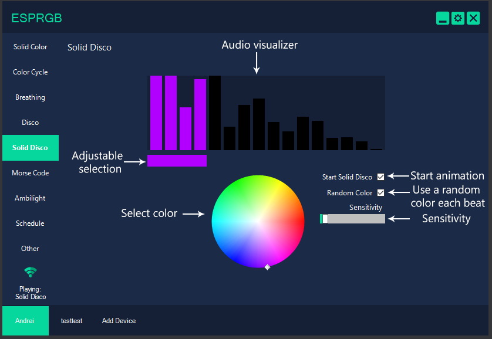

# ESPRGB-Client

ESPRGB-Client is built to control your rgb led strip from your PC with devices that are ESPRGB compatible. This client can do audio reactive led without using a microphone, ambilight, create schedules (by application), sync all your devices together, open and close the lights when whenever your pc is running and many more.

You can find a video version here: [youtube](https://www.youtube.com/watch?v=HbQ0Hno2rTk&list=PLpYguLWjYcdbfyVIKRt1rsTTXNF7Dq1y1&index=2)

For more information about ESPRGB go here: [ESPRGB-8266](https://github.com/limiteddata/ESPRGB-8266)

If you want to contact me or have any question you can at: **limiteddata90@gmail.com**

If you've found a bug you can report it at: [issues](https://github.com/limiteddata/ESPRGB-Client/issues)

And also the road map of the project is here: [road map](https://github.com/limiteddata/ESPRGB-Client/projects/1)

**Note:** Most of the information in here will be mostly the same with the web client.

**Now let's get familiar with the interface.**

First of all you need to add a new device. You can type the ipaddress of your esp or you can scan for your ESPRGB device by pressing the scan button, this will do a mdns scan for any device with esprgb as a tcp service.

Each tab is a animation. To play an animation you can click select a tab and then the checkbox or double tap the tab or from the tray menu.

**Solid Color** is the default animation and the simplest animation. A color wheel, a brightness slider and 5 preset colors that you can save by right clicking the preset button and then left to set the color to that.
The power on/off button is set to turn off the lights from any animation.

**Color Cycle** goes in loop through RGB by fading from one color to the other. You can also modify the speed as you like.

**Breathing** will fade from the selected color to black and back. You can also change the speed.

By checking **Use Color List** you can create a custom color sequence, otherwise will fade only the selected color. Select a color and press the + button. Pressing - and it will remove the last color and C will clear the entire sequence.

**Disco** (windows client only) is grabbing the audio output of your pc and it does a fft analysis to split the audio into 3 sections that you can adjust and set to red green blue or none. The different frequencies from the music you listen, the max brightness of each section, the sensitivity and the color of each section will determine the final color your esp will show.
The brightness slider will change the maximum peak that each selection can hit. Sensitivity will remove the "noise" or the low volume sound.

**Solid Disco** (windows client only) is mostly the same as disco but you can only one range of frequencies but a rgb color. You can change the color manually or check the **Random Color** and it will change randomly each beat. The range can be adjust by dragging the bar under the visualizer. Sensitivity will remove the "noise" or the low volume sound.

**Morse Code** is straightforward, it takes a message and will flash the led strip with the selected color and the buzzer (if checked) at the you like speed.  

**Ambilight** (windows client only) grabs the average colors from your screen or a static image. You can change the screen grab interval to lower utilization, add multiple selections. The static image tab is the last one and you can select the image of choice by double clicking the screen preview.

**Schedule** (windows client only) is per application based schedule where you can automate your lightning in a priority stack, the highest opened app in the stack will take action. (ex. if spotify is opened play solid disco but if csgo is opened at the same time will turn off all the lights). You can also modify the parameters (properties) the application starts with.

**Other**

In here there's nothing much to be talked about.

But there are two buttons you may want to take advantage of, the **Sync device** and the **Power if connected**.

**Sync device** will sync all the animation with all the parameters from the devices that have this option on. Useful if you have multiple controllers in the same room.

**Power if connected** will set the esp automatically turn on/off the lights when all the clients are connected/disconnected. Also this is useful if you have the client added to startup.

Thank you for trying ESPRGB or at least taking a look at what I've done on this project.
